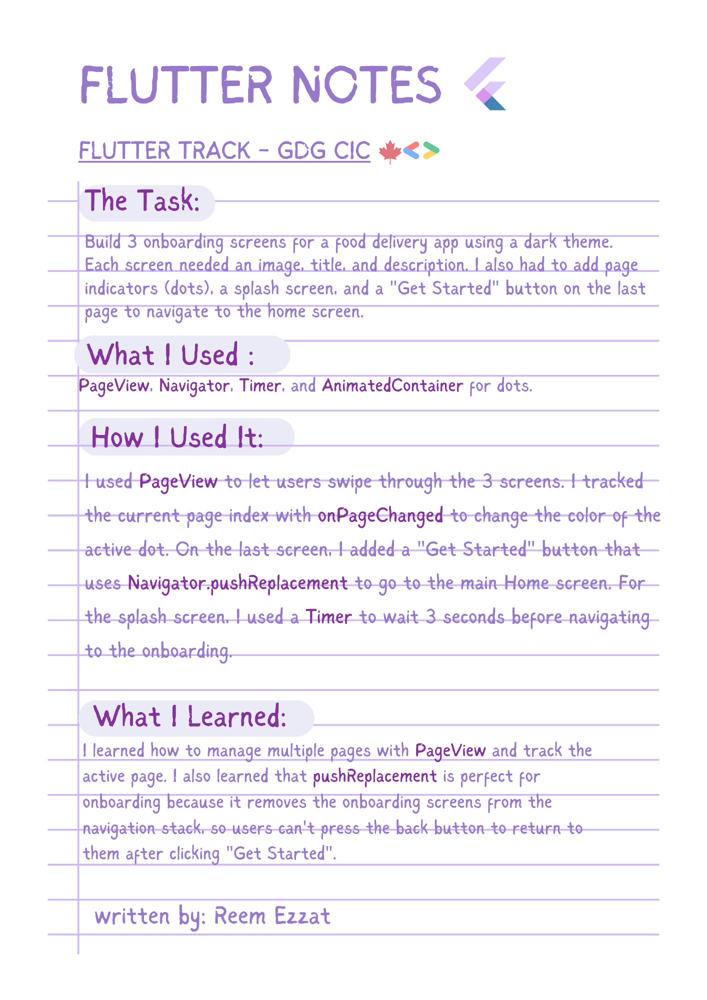
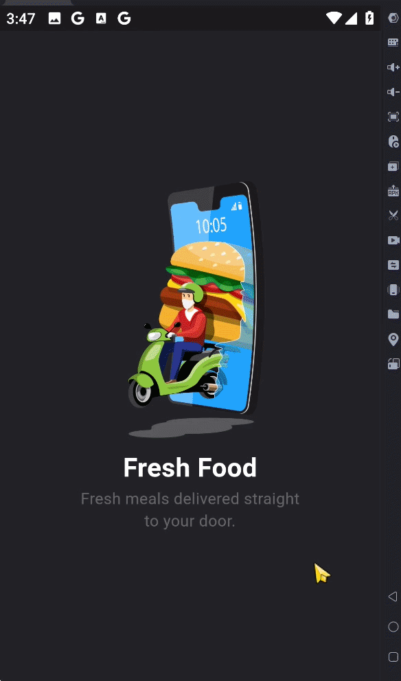

# Food-Delivery-App-Screens🍔📱




## 💻 Example Code

```dart
// Navigating to Home Screen and removing onboarding from the stack
Navigator.pushReplacement(
  context,
  MaterialPageRoute(builder: (context) => const Home()),
);

// Tracking page changes for the dots
PageView(
  onPageChanged: (index) {
    setState(() {
      _currentPage = index;
    });
  },
  children: [ /* Screens */ ],
)
````
💡 **Tip:** When building page indicators (dots), don't just use normal Containers. Wrap them in an AnimatedContainer and add a duration! This will make the active dot smoothly grow or change color when the user swipes, making your UI feel much more premium and polished.

## 🎬 DEMO


